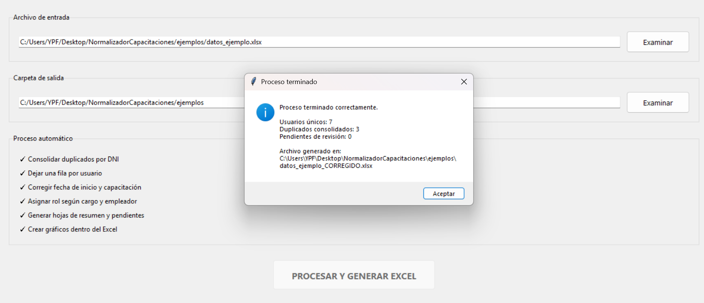
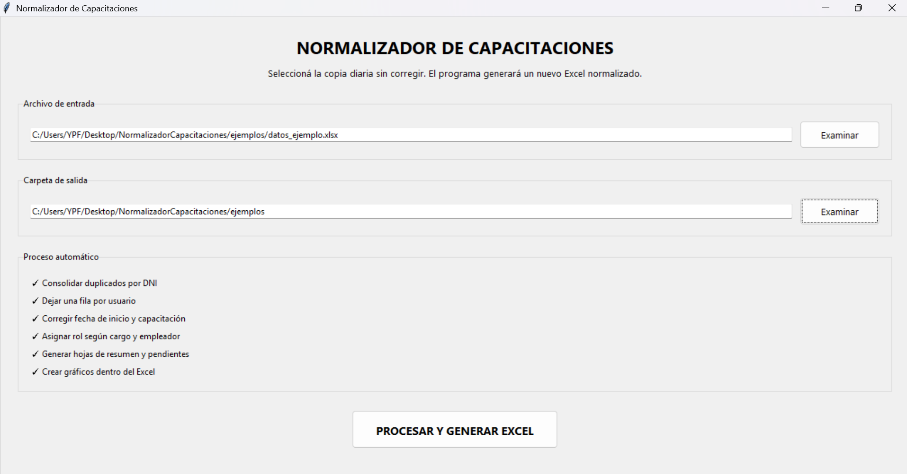
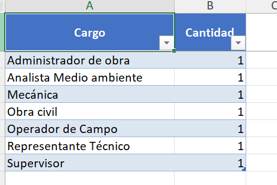
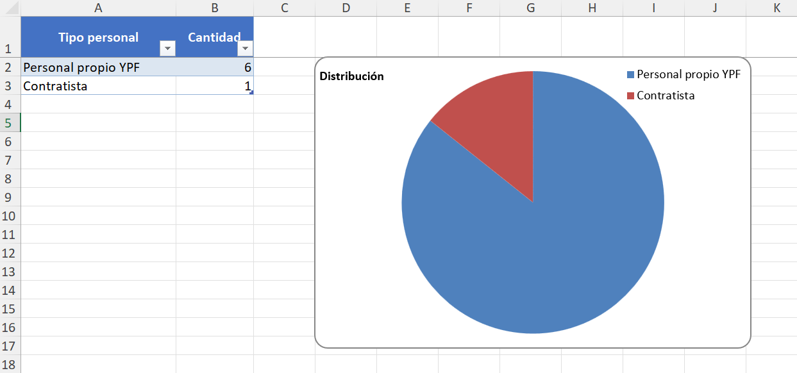
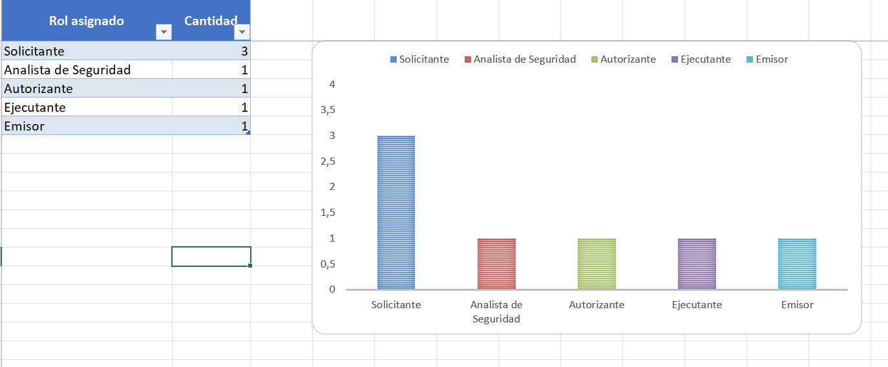

# 📊 Training Data Normalizer

Aplicación de escritorio desarrollada en Python para automatizar el procesamiento, normalización y análisis de registros de capacitación provenientes de archivos Excel.

El proyecto permite transformar registros sin procesar en una base de datos consolidada y estructurada, aplicando automáticamente reglas de negocio y generando un nuevo archivo Excel con información corregida, indicadores, resúmenes y visualizaciones.

---

## 🎯 Objetivo del proyecto

El objetivo principal es automatizar un proceso que originalmente requería revisión y corrección manual de registros.

La aplicación permite:

- Importar registros desde archivos Excel.
- Detectar y consolidar registros duplicados.
- Unificar múltiples registros pertenecientes a un mismo usuario.
- Normalizar información según reglas de negocio.
- Corregir y validar fechas.
- Clasificar usuarios automáticamente.
- Asignar roles según diferentes criterios.
- Identificar registros que requieren revisión manual.
- Generar un nuevo archivo Excel corregido.
- Crear hojas de resumen y análisis.
- Generar gráficos automáticamente.
- Seleccionar una carpeta personalizada para guardar los resultados.

---

## ⚙️ Funcionamiento

El usuario selecciona desde la interfaz gráfica un archivo Excel con los registros originales.

La aplicación procesa automáticamente la información siguiendo diferentes etapas:

1. Lectura y validación del archivo.
2. Filtrado de los registros correspondientes al alcance definido.
3. Consolidación de registros duplicados.
4. Unificación de registros por usuario.
5. Normalización de cargos y categorías.
6. Aplicación de reglas de negocio.
7. Clasificación automática de usuarios.
8. Asignación de roles.
9. Identificación de casos pendientes de revisión.
10. Generación de un nuevo archivo Excel normalizado.
11. Creación automática de hojas de resumen y gráficos.

El usuario puede seleccionar la carpeta de destino donde desea guardar el archivo generado.

---

## 🖥️ Interfaz de usuario

La aplicación cuenta con una interfaz gráfica de escritorio que permite utilizar el normalizador sin necesidad de conocimientos de programación.

Desde la interfaz es posible:

- Seleccionar el archivo de entrada.
- Seleccionar la carpeta de salida.
- Ejecutar el proceso de normalización.
- Visualizar el estado del procesamiento.
- Consultar la cantidad de usuarios procesados.
- Consultar registros duplicados consolidados.
- Consultar casos pendientes de revisión.
- Abrir directamente el Excel generado.

---

## 📈 Archivo de salida

El sistema genera automáticamente un archivo Excel estructurado con diferentes hojas para facilitar el análisis de la información.

Entre ellas:

- Base de datos corregida.
- Registros pendientes de revisión.
- Resumen de usuarios.
- Distribución por roles.
- Distribución por tipo de personal.
- Indicadores generales.
- Gráficos generados automáticamente.

Esto permite utilizar el resultado tanto para análisis operativo como para futuras herramientas de Business Intelligence.

---

## 🧠 Reglas de negocio

La aplicación utiliza un sistema modular de reglas y equivalencias.

Los cargos provenientes del archivo original son normalizados antes de aplicar las reglas de clasificación.

Esto permite reconocer diferentes formas de escribir un mismo cargo y asignar automáticamente la categoría o rol correspondiente.

La arquitectura separa:

- Normalización de datos.
- Equivalencias de cargos.
- Reglas de negocio.
- Configuración de campos.
- Generación del archivo Excel.
- Interfaz gráfica.

Esta separación facilita el mantenimiento y permite incorporar nuevas reglas sin modificar toda la aplicación.

---

## 🛠️ Tecnologías utilizadas

### Python
Lenguaje principal utilizado para desarrollar la lógica de procesamiento y automatización.

### Pandas
Utilizado para la manipulación, limpieza, transformación, agrupación y consolidación de los datos.

### OpenPyXL
Utilizado para generar y dar formato a los archivos Excel, crear tablas, hojas de resumen y gráficos.

### Tkinter
Utilizado para desarrollar la interfaz gráfica de escritorio y permitir que usuarios no técnicos puedan utilizar la aplicación.

### PyInstaller
Utilizado para empaquetar la aplicación como un archivo ejecutable `.exe`, permitiendo utilizarla en equipos Windows sin necesidad de ejecutar el código fuente directamente.

### Microsoft Excel
Formato utilizado como fuente de entrada y como archivo final para la presentación y análisis de resultados.

## 📸 Capturas de la aplicación

### Interfaz principal

La aplicación permite seleccionar el archivo de entrada y ejecutar automáticamente el proceso de normalización.



### Procesamiento de datos

Visualización de la aplicación durante el procesamiento de los registros.



### 📊 Reportes generados

La aplicación genera automáticamente diferentes reportes y visualizaciones dentro del archivo Excel resultante.

#### Distribución por cargo



#### Distribución por empresa



#### Distribución por rol



---

## 📁 Estructura del proyecto

```text
TrainingDataNormalizer/
│
├── app.py
├── normalizador.py
├── reglas.py
├── equivalencias.py
├── excel_salida.py
├── config_forms.py
├── requirements.txt
├── README.md
│
└── examples/
    ├── datos_ejemplo.xlsx
    └── resultado_ejemplo.xlsx


## 🔒 Privacidad de los datos

Este repositorio fue desarrollado con fines demostrativos y de portfolio.

Los archivos disponibles en la carpeta `examples/` contienen exclusivamente datos ficticios y generados aleatoriamente para demostrar el funcionamiento de la aplicación.

Los nombres, documentos, fechas y demás información incluida en los archivos de ejemplo no corresponden a personas reales.

No se incluyen datos personales, información confidencial ni archivos reales pertenecientes a ninguna organización o usuario.